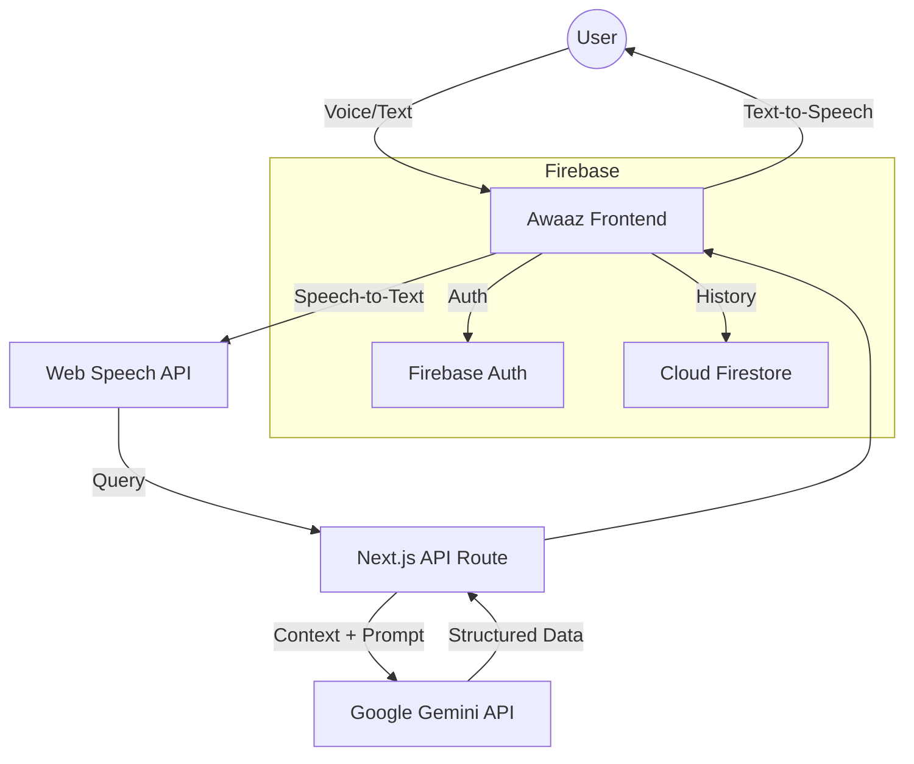

#  Awaaz (आवाज़)


**Giving People Access to Their Rights — Simply by Speaking.**  
*A voice-first, AI-powered platform that helps citizens discover government welfare schemes without reading, typing, or navigating complex portals.*


## 🔗 **Live Demo:** https://awaaz12-47lq.vercel.app/

## 🚀 Overview

Millions of Indians miss out on government welfare schemes not because they are ineligible — but because access itself is difficult.

Complex websites, English-heavy language, and digital literacy barriers prevent elderly, rural, and underprivileged citizens from discovering schemes meant for them.

**Awaaz** removes this barrier by replacing forms and filters with **conversation**.

Users simply **speak** in their own language (English, Hindi, or Bhojpuri), and Awaaz:

- Understands their situation  
- Finds relevant government schemes  
- Reads out eligibility and benefits  
- Guides them step by step  

**Built for TechSprint 25 @ GDG NIT Patna.**

## 💡 The Problem

- **Literacy Barrier:** Many citizens cannot comfortably read long forms or instructions.
- **Language Gap:** Most portals ignore regional dialects like Bhojpuri.
- **Cognitive Load:** Elderly users struggle with search, dropdowns, and navigation.
- **Information Fragmentation:** Schemes are scattered across multiple government websites.

## ✨ Key Features

- **🎙️ Voice-First Interface**  
  No keyboard required. Large, accessible microphone-driven interaction.

- **🗣️ Trilingual Support**  
  Works seamlessly in **English**, **Hindi**, and **Bhojpuri**.

- **🧠 AI Intent Understanding**  
  Powered by **Google Gemini API** to map real-life problems to the right schemes.

- **🔊 Text-to-Speech (TTS)**  
  Scheme details are read aloud for users who prefer listening over reading.

- **🕒 Recently Viewed Schemes**  
  Logged-in users can revisit schemes they explored earlier.

- **🔐 Optional Authentication**  
  Email & Google login via Firebase — or continue without logging in.

- **👴 Elderly-Friendly Design**  
  Large buttons, high contrast, minimal clutter.

## 🛠️ Tech Stack

| Layer | Technology | Purpose |
|------|------------|---------|
| **Frontend** | Next.js 14, TypeScript | Fast, scalable UI |
| **Styling** | Tailwind CSS, Framer Motion | Clean UI & animations |
| **AI Engine** | Google Gemini API | Intent detection & scheme mapping |
| **Database** | Firebase Firestore & DataStax | User history & Schemes data |
| **Authentication** | Firebase Auth | Email & Google login |
| **Voice** | Web Speech API | Speech-to-Text & Text-to-Speech |

## 📸 Screenshots

| Landing Page | Voice Search Dashboard |
|--------------|------------------------|
| |  |


## 🏗️ Getting Started

### Prerequisites

- Node.js (v18+)
- Firebase Project
- Google Cloud Project (Gemini API enabled)

### Installation

1. **Clone the repository**
```bash
git clone https://github.com/your-username/awaaz.git
cd awaaz
```
 
2. **Install dependencies**
```bash
npm install
```

3. **Set up environment variables**
Create a .env.local file in the root directory:
```bash
# Google Gemini
GOOGLE_GENAI_API_KEY=your_gemini_api_key

# Firebase
NEXT_PUBLIC_FIREBASE_API_KEY=your_api_key
NEXT_PUBLIC_FIREBASE_AUTH_DOMAIN=your_project.firebaseapp.com
NEXT_PUBLIC_FIREBASE_PROJECT_ID=your_project_id
NEXT_PUBLIC_FIREBASE_STORAGE_BUCKET=your_project.appspot.com
NEXT_PUBLIC_FIREBASE_MESSAGING_SENDER_ID=your_sender_id
NEXT_PUBLIC_FIREBASE_APP_ID=your_app_id
```

4. **Run the development server**
```bash
npm run dev
```

5. **Open the app**
```bash
http://localhost:3000
```


## 🧩 Architecture



## 🔮 Future Roadmap

- **📄 Document Scanning**  
  OCR-based reading of Aadhaar / Ration cards.

- **📴 Offline Access**  
  SMS / IVR-based queries for feature phones.

- **🧑‍💼 Agent Mode**  
  Dashboard for village helpers (“Yojna Sathis”).

- **🌍 More Languages**  
  Maithili, Bengali, Tamil, Telugu support.

## 🤝 Contributing

Contributions are welcome!  
Fork the repository and submit a pull request with a clear description.

## 📄 License

This project is licensed under the **MIT License**.


**Made with ❤️ for TechSprint 25**  
**Team Awaaz**
